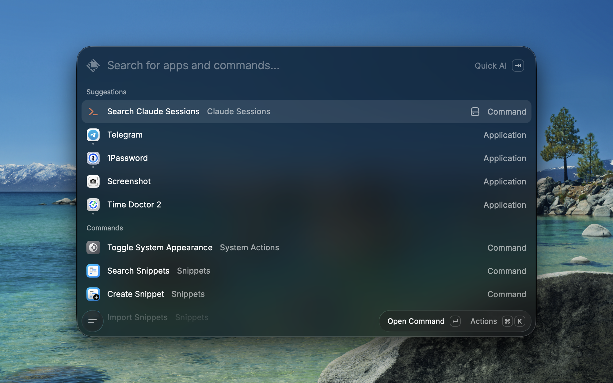
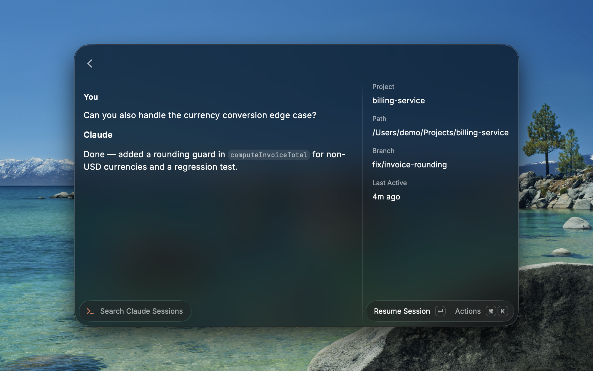

# Claude Sessions

Search, pin, and resume your [Claude Code](https://claude.com/claude-code) sessions from Raycast.

## Screenshots

| Search | Discover | Resume |
| --- | --- | --- |
|  |  |  |

## Requirements

- The `claude` CLI must be installed and on your `PATH`.
- macOS only — session resumption relies on AppleScript and app-specific terminal integrations.

## How it works

The extension reads session history from `~/.claude/projects`, letting you search by session title,
project, or branch. Selecting a session opens a detail view with its last exchange; resuming from
there launches your chosen terminal app and runs `claude --resume <session-id>` in that session's
original working directory.

## Preferences

- **Terminal** — the app used to resume a session. Terminal.app, iTerm, and Ghostty run the resume
  command automatically. Any other terminal app opens at the session's folder with the resume
  command copied to your clipboard to paste in yourself.
